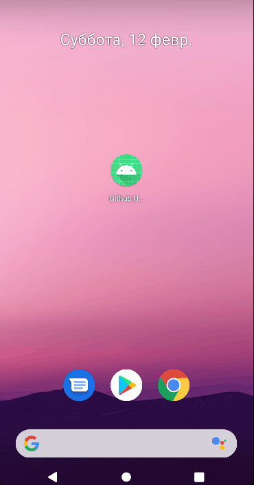
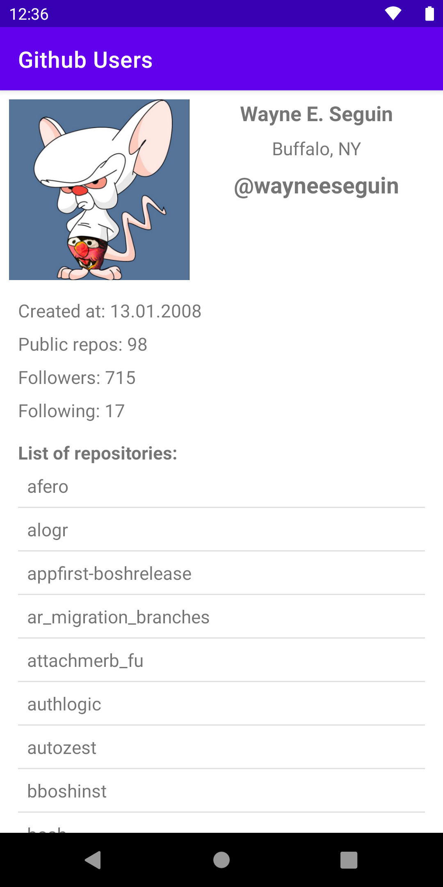
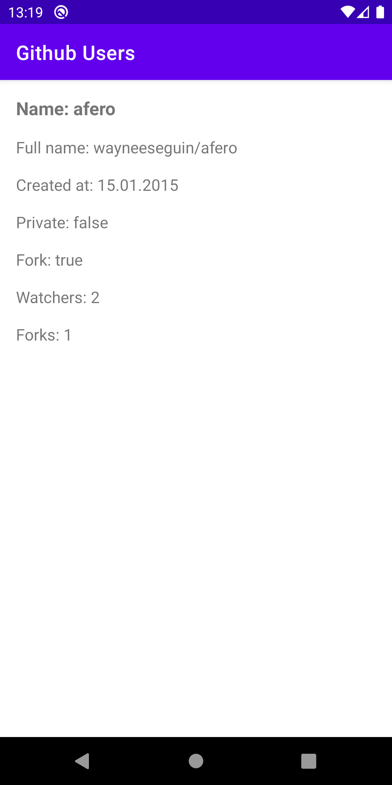
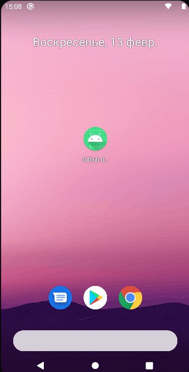

# Домашнее задание 2.
Реализуйте экран пользователя, на котором отобразите его логин. Переход на экран осуществите по клику на пользователя в списке через router.navigateTo.

# Получившийся результат.

Что было сделано:
1. Внёс изменения в IScreens, добавил новый метод user(userId: Int). Реализовал его в классе AndroidScreens.
2. Внёс изменения в UsersPresenter, теперь в конструкторе этот класс принимает IScreens для осуществления перехода на экран конкретного пользователя. Реализовал переход через router.navigateTo. Переделал вызов конструктора UsersPresenter в UsersFragment.
3. Добавил в класс GithubUser свойство id для дальнейшего использования.
4. Внёс изменения в класс GithubUsersRepository, добавил функцию getUserById, которая возвращает GithubUser по userId.
5. Создан новый интерфейс UserView с функцией updateView, которая принимает GithubUser.
6. Создан новый фрагмент UserFragment, который при создании через newInstance принимает userId и хранит его в аргументах. Также новый фрагмент реализует функцию updateView интерфейса UserView.
7. Реализован новый класс UserPresenter, в котором во время onFirstViewAttach происходит загрузка данных и отображение через viewState.updateView.

# Домашнее задание 3.
1. Переделайте взаимодействие модели и логики в коде из второго урока на Rx-паттерн.
2. \* Самостоятельно изучите оператор switchMap. Разберитесь, как он работает и чем отличается от flatMap. Сформулируйте и напишите ответ в комментарии к практическому заданию. Для экспериментов воспользуйтесь приведённым на уроке примером с flatMap, замените его на switchMap, а остальное оставьте без изменений.

# Получившийся результат.

Что было сделано:
1. Внёс изменения в GithubUsersRepository. Теперь функции getUsers() и getUserById() будут возвращать Observable.
2. Внёс изменения в UsersPresenter и UserPresenter. Переделал на взаимодействие с Observable.

Если flatMap из каждого элемента создаёт новый источник, после чего выполняет слияние этих источников, похожее на применение над ними оператора merge, то  switchMap по сути берет последний сгенерированный Observable, а от предыдущих отписывается.

# Домашнее задание 5.
1. По клику на пользователя отобразите список его репозиториев, воспользовавшись полями repos_url в api и аннотациями @Url библиотеки retrofit.
2. По клику на репозиторий в списке отобразите экран с информацией о нём (например, количество форков).

# Получившийся результат.

Что было сделано:
1. Добавлены новые модели.
2. Добавлены новые функции в GithubApiService.
3. Переделан экран с отображением информации о пользователе, в том числе со списком репозиториев.
4. Создан новый экран с информацией о конкретном репозитории.

 
 
 

# Домашнее задание 6.
1. Вытащите кеширование в отдельные классы RoomGithubUsersCache и RoomGithubRepositoriesCache. Организуйте их внедрение в репозиторий через интерфейсы.
2. \*\* Реализуйте свой кеш картинок, используя listener() библиотеки Glide. Картинки храните на диске, а в Room — CahedImage(url, localPath). Задание предназначено, чтобы поупражняться с Room. В реальности лучше используйте встроенный кеш Glide.

Что было сделано:
1. Отделил GithubReposRepository от GithubUsersRepository.
2. Добавил базу данных в проект. 
3. Реализовал GithubUsersCacheImpl и GithubReposCacheImpl.
4. Добавил новую таблицу CachedImage в базу данных с помощью миграции.
5. Реализовал GlideImageCacheLoader, в которой:
    1) Отключен встроенный кэш Glide с помощью diskCacheStrategy(DiskCacheStrategy.NONE).
    2) В onResourceReady сохраняю кэш на диск и информацию об этом в CachedImage.
    3) В onLoadFailed проверяю наличие файла в CachedImage, если запись существует, то загружаю файл с диска.
6. Добавил HttpLoggingInterceptor для удобной отладки.

 

# Домашнее задание 7.
Вынесите в модули все остальные зависимости, чтобы DI полностью сформировался через Dagger. Уберите лишние @Inject там, где они станут не нужны.

Что было сделано:
Реализовал DI в проекте.