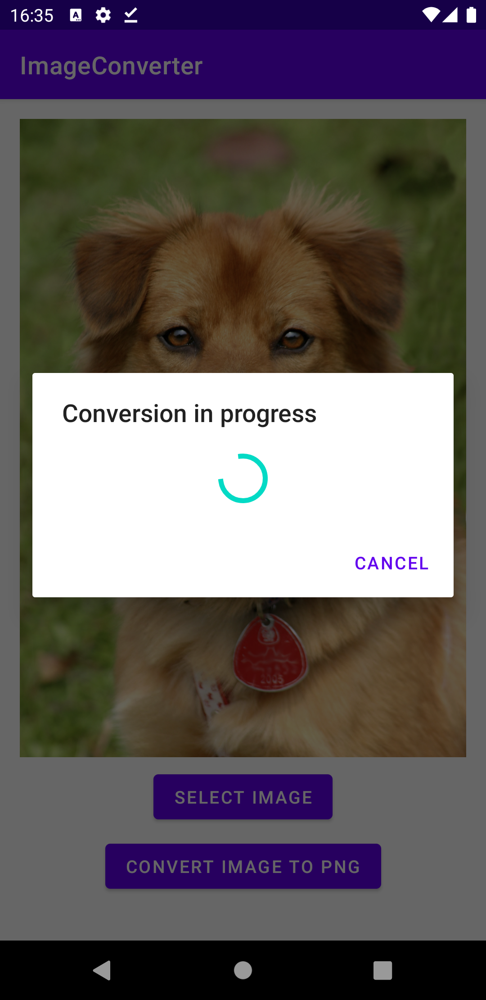

# Домашнее задание 4.
1. Соблюдая MVP, напишите маленькое приложение, которое по нажатию кнопки читает файл-картинку формата jpg из файловой системы, а затем конвертирует её в png и записывает обратно в файловую систему. Чтение и запись должны производиться не в UI-потоке.
2. \*Добавьте в предыдущем примере возможность отказаться от проведения операции, выведя после начала в UI-поток диалоговое окно с надписью «Выполняется конвертация» и кнопкой «Отменить». Для наглядности замедлите процессы в фоновом потоке посредством метода sleep().

# Получившийся результат.

Что было сделано:
1. Создан новый пустой проект.
2. Реализована архитектура MVP с помощью Moxy, в моем случае без модели.
3. Реализован выбор изображения jpeg с помощью контракта GetContent(). После выбора изображения появляется кнопка для запуска конвертации.
4. Сначала была реализована конвертация изображения из jpeg в png синхронно, без Rx, затем подключил Rx. 
5. Для реализации конвертации изображения в фоне использовал Completable.
6. Для сохранения изображения предусмотрел 2 варианта:
    1) Если Android Q (API 29) и выше, тогда использую MediaStore.
    2) Если меньше Android Q (API 29), то тогда использую getExternalStoragePublicDirectory.
7. Сконвертированое изображение сохраняется в Environment.DIRECTORY_PICTURES.
8. В проекте используется запрос разрешения "android.permission.WRITE_EXTERNAL_STORAGE", если меньше Android Q (API 29).
9. Добавлен диалог с progressbar, который появляется при запуске процесса конвертации. При нажатии на Cancel, происходит отмена (dispose) процесса конвертации.
10. После завершения операции выводится Toast: "Operation completed successfully".

 
 